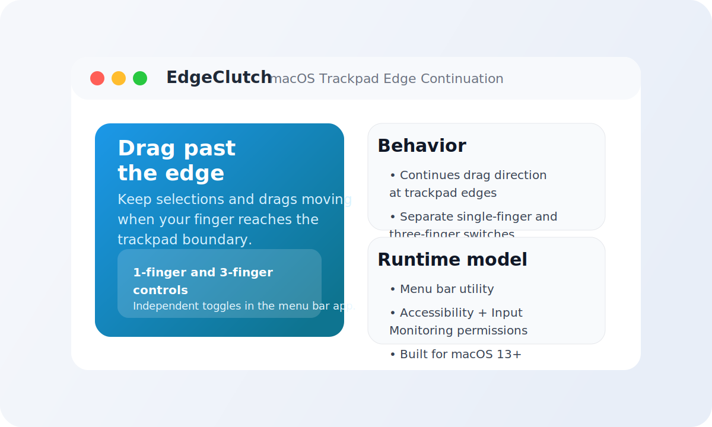

# EdgeClutch

A macOS menu bar utility that keeps drag movement going after your finger reaches the trackpad edge.

Current version: `1.0.1`

Direct download: [EdgeClutch 1.0.1](https://github.com/dfsc8/EdgeClutch/releases/tag/v1.0.1)



## Highlights

- Continues drag direction when your finger hits the trackpad edge
- Works with drag-to-select interactions such as screenshot region selection
- Independent one-finger and three-finger switches
- Explicitly blocks two-finger continuation
- Runs as a lightweight menu bar app

## Release

- Latest release: [`v1.0.1`](https://github.com/dfsc8/EdgeClutch/releases/tag/v1.0.1)
- Packaged app: [`EdgeClutch-1.0.1.zip`](https://github.com/dfsc8/EdgeClutch/releases/download/v1.0.1/EdgeClutch-1.0.1.zip)

## What it does

- Watches global left-button drag activity, including drag-to-select style interactions such as screenshot region selection.
- Reads raw built-in trackpad contacts from `MultitouchSupport.framework`.
- When a drag is already in progress and a finger stays pressed against a trackpad edge, it synthesizes additional `leftMouseDragged` events in the same direction.
- Stops assisting as soon as the drag ends or the finger leaves the edge zone.

## Demo

Typical flow:

1. Start dragging a file, selection box, or screenshot region.
2. Reach the edge of the built-in trackpad.
3. Keep pushing in the same direction.
4. EdgeClutch continues the drag instead of forcing you to lift and reposition immediately.

## Why this is a menu bar app instead of a plugin

macOS does not expose an official plugin point for this behavior. The workable form factor is:

- a background accessory app
- with `Input Monitoring` permission to observe global mouse drag events
- with `Accessibility` permission to post synthetic drag events

## Requirements

- macOS 13+
- built-in trackpad
- Accessibility permission
- Input Monitoring permission

## Recommended run flow

Open the native Xcode project:

```bash
open EdgeClutch.xcodeproj
```

Then in Xcode:

- choose the `EdgeClutch` scheme
- open `Signing & Capabilities`
- choose your Apple account team once so Xcode can use a stable `Apple Development` signature
- build and run once
- authorize `xcode-build/Debug/EdgeClutch.app` in `Accessibility` and `Input Monitoring`

The Xcode project writes the app to a stable path:

- `xcode-build/Debug/EdgeClutch.app`
- `xcode-build/Release/EdgeClutch.app`

That stable app path is the preferred way to keep macOS permission records from drifting between builds.
If you leave the project on ad-hoc or local-only signing, macOS may still treat each rebuild as a new app for TCC permissions.

## SwiftPM run

```bash
swift run
```

The app appears as a menu bar item named `EdgeClutch`. Grant the requested permissions in System Settings, then relaunch it.

## Legacy bundle script

```bash
./scripts/build_app.sh debug
```

or:

```bash
./scripts/build_app.sh release
```

This produces a real macOS app bundle at:

- `dist/Debug/EdgeClutch.app`
- `dist/Release/EdgeClutch.app`

The script copies the SwiftPM-built executable into a normal `.app` structure, adds `Info.plist`, and applies ad-hoc signing so the bundle can be launched directly.
It is still useful for quick packaging, but the Xcode project is the better day-to-day workflow because it keeps the app identity and output path more stable.

## Implementation notes

- The project uses the private `MultitouchSupport.framework` at runtime via `dlopen`/`dlsym`.
- Because that framework is private, this prototype is best suited for personal use and experimentation, not App Store distribution.
- Shutdown waits briefly before calling `MTDeviceStop` because immediate stop after callback removal is known to race inside the private framework.
- The app bundle is an accessory app (`LSUIElement=1`), so it runs from the menu bar without a Dock icon.

## Current limitations

- It targets the built-in trackpad path, not every possible external pointing device.
- Edge continuation is heuristic and tuned for single-finger and three-finger sessions only.
- The Xcode project is set up for stable local development signing (`Apple Development`), but you still need to select your own team in Xcode once.
- There is no Developer ID signature or notarization yet.
